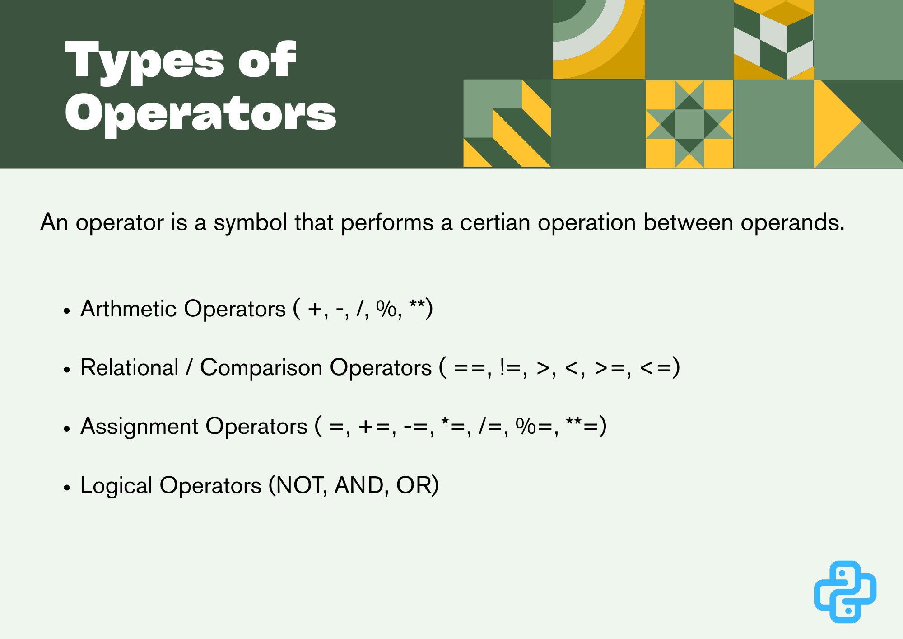

# Day 4 – Python Operators

Welcome to **Day 4** of my **Python Zero to Advanced Journey**.  
Today’s focus was on **Python Operators**, which are used to perform calculations, comparisons, and logical decisions inside a program.

Operators are a core concept because **almost every program uses them** in some form.

---

## 📌 Topics Covered Today

### 1️⃣ Arithmetic Operators
- Performing mathematical calculations
- Operators used:
  - `+` Addition
  - `-` Subtraction
  - `*` Multiplication
  - `/` Division
  - `%` Modulus
  - `//` Floor Division
  - `**` Exponentiation

---

### 2️⃣ Comparison Operators
- Comparing two values and returning a boolean result (`True` or `False`)
- Operators used:
  - `==` Equal to
  - `!=` Not equal to
  - `>` Greater than
  - `<` Less than
  - `>=` Greater than or equal to
  - `<=` Less than or equal to

---

### 3️⃣ Logical Operators
- Used to combine or reverse conditions
- Operators used:
  - `and` → True if all conditions are true
  - `or` → True if at least one condition is true
  - `not` → Reverses the condition result

---

### 4️⃣ Assignment Operators
- Used to assign and update variable values
- Operators used:
  - `=`
  - `+=`
  - `-=`
  - `*=`
  - `/=`

---

## 🧠 Programs Written Today

### ✅ Program 1: Arithmetic Operations
**Concepts used:**
- Variables
- Mathematical operators

**What it does:**
- Performs basic calculations between two numbers
- Displays the results of addition, subtraction, multiplication, and division

**Real-life use cases:**
- Calculator applications
- Billing systems
- Financial calculations
- Game score systems

---

### ✅ Program 2: Comparison Operators Example
**Concepts used:**
- Value comparison
- Boolean results

**What it does:**
- Compares two numbers and prints whether conditions are true or false

**Real-life use cases:**
- Exam result evaluation
- Age verification systems
- Access control (allowed / denied)
- Ranking and sorting logic

---

### ✅ Program 3: Logical Operators Example
**Concepts used:**
- Combining conditions
- Logical decision-making

**What it does:**
- Uses `and`, `or`, and `not` operators with conditions
- Demonstrates how complex decisions are made in programs

**Real-life use cases:**
- Login systems (username AND password check)
- Eligibility checks
- Permission systems
- Automation rules

---

## 🎯 Learning Outcome

- Understood how Python performs calculations
- Learned how conditions are evaluated
- Gained clarity on how decisions are combined logically
- Built a strong foundation for control flow and advanced logic

---

## 🔗 Author

**Agrojit**  
Python Learner | Daily Progress | Zero to Advanced
