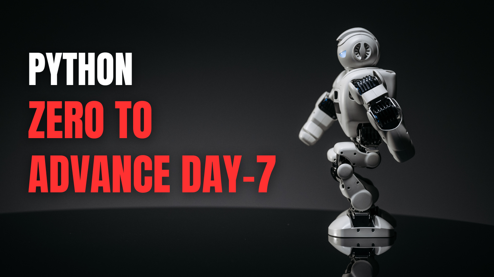

# Day 7 – Python `List` Fundamentals (Topics 1–6)

Welcome to **Day 7** of my **Python Zero to Advanced Journey**.  
Today’s class focused on the **fundamental concepts of Python `List`**, covering how to create lists, access and modify items, and perform basic calculations like total and average.  
Since lists are one of the most common data structures in Python, mastering them is essential for building real-world applications.

---

## 📌 Topics Covered Today

Today we covered **Topics 1 to 6** of Python `List`:

- What a Python `List` is and its real-life analogy  
- Creating lists and accessing items using **index**  
- Adding new items with `append()` and removing items with `remove()`  
- Getting the length of a list using `len()`  
- Using `for` loops to iterate through list items  
- Calculating **total** and **average** of numeric lists  
- Displaying category-wise data using list and tuple together  

---

## 🧠 Practice & Examples

During the class, we practiced multiple small programs that demonstrated:
- Creating a list of expenses and accessing specific items  
- Adding and removing items from a list dynamically  
- Using loops to calculate total monthly expenses  
- Calculating average expense with `sum()` and `len()`  
- Iterating parallel lists and tuples to show category-wise expenses  

These exercises helped connect Python theory with **real-life applications**, like monthly expense tracking.

---

## 🎯 Learning Outcome

By the end of today’s class:
- I clearly understood how to create, access, and modify Python lists  
- I practiced iterating through lists using loops  
- I learned how to calculate total and average values from lists  
- I can now display structured data by combining lists and tuples  
- I gained confidence to build simple real-life projects like a **Monthly Expense Tracker**

---

## 🚀 Next Class Plan

In the next session, we will cover **Python Tuple**:
- Understanding immutable sequences  
- Creating and accessing tuples  
- Tuple unpacking  
- Using tuples in real-life projects with lists  

---

## 🔗 Author

**Agrojit**  
Python Learner | Daily Progress | Zero to Advanced
